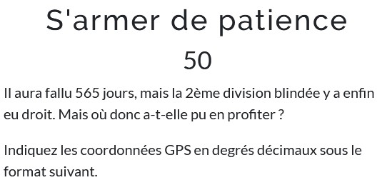
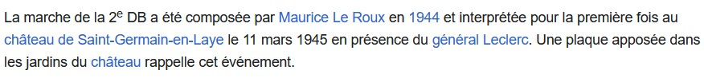
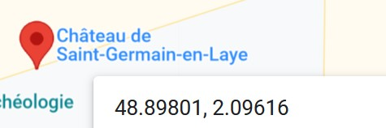

# S'armer de patience

## Énoncé :

Il aura fallu 565 jours, mais la 2ème division blindée y a enfin eu droit. Mais où donc a-t-elle pu en profiter ?

Indiquez les coordonnées GPS en degrés décimaux sous le format suivant.

La page Wikipédia de la 2ème division blindée nous indique à nouveau la réponse,
il y a bien eu 565 jours entre la création de la 2ème division blindée et la première interprétation de la marche au château de Saint-Germain-en-Laye
https://fr.wikipedia.org/wiki/2e_division_blind%C3%A9e_(France)

La réponse est donc la localisation du chateau de Saint-Germain-en-Laye

Flag: BLEUET{48.89,2.09}
