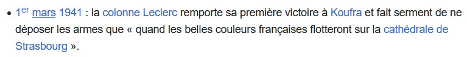

# Une promesse tenue

## Énoncé :

Quel bâtiment clôt une célèbre formule prononcée à l’issue d’une victoire décisive de la 2ème division blindée ?

La page Wikipédia de la 2ème division blindée nous indique la réponse

https://fr.wikipedia.org/wiki/2e_division_blind%C3%A9e_(France)

Flag: BLEUET{cathédrale}
